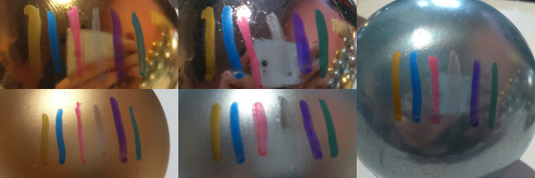
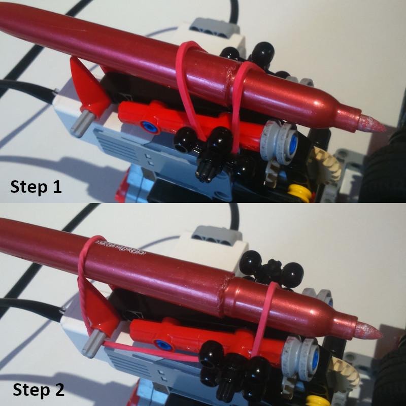
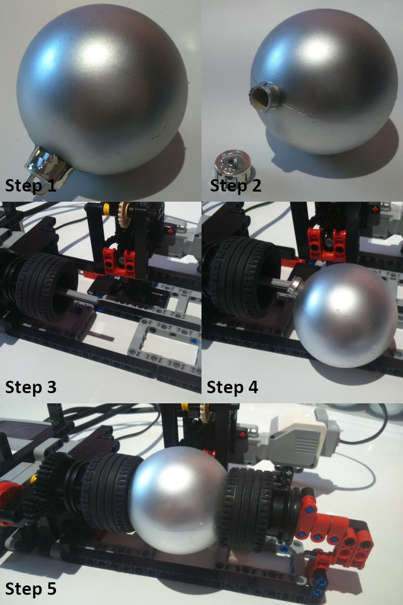
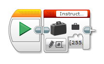
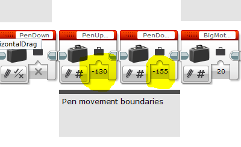
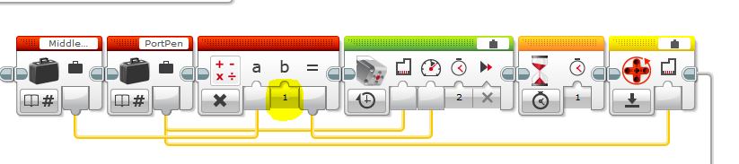
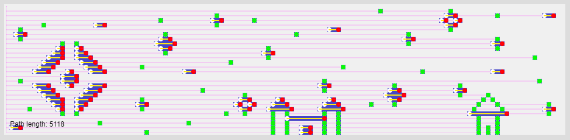
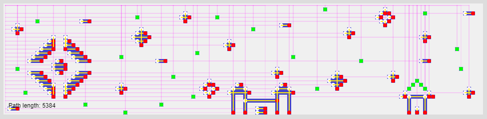
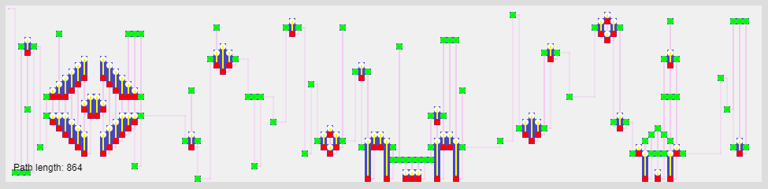

# EV3 Christmas Ball Decorator
'EV3 Christmas Ball Decorator' to projekt pozwalający na łatwe przyozdabianie bombek choinkowych własnymi wzorami.
Wzory można projektować w dedykowanym edytorze. Pozwala on na łatwe utworzenie grafiki i przekonwertowanie jej na instrukcje zrozumiałe dla plotera. Instrukcje te wklejane są jako tablica do oprogramowania dla brick'a EV3. 

Projekt składa się z 3 zasadniczych elementów:
- Dekoratora z LEGO
- Edytora wzorów
- Oprogramowania dla brick'a EV3

### Spis treści
- [Pisak](#pisak)
- [Bombki](#bombki-choinkowe)
- [Edytor wzorów](#edytor-wzorów)
- [Drukowanie](#drukowanie-wzoru)
- [Rozwiązywanie problemów](#rozwiązywanie-problemów)
- [Dodatek: Drukarka czy ploter?](#ścieżka-głowicy---drukarka-czy-ploter)

### Dodatkowe materiały
- Gumka recepturka (gumka z zestawu może być zbyt krótka)
- Pisak permanentny, najlepiej w kolorze kontastującym z barwą bombek
- Bombki choinkowe o średnicy 6 cm

### Budowa modelu
Instrukcje potrzebne do budowy modelu dostępne są jako plik pdf.
Wszystkie elementy wymagane do budowy zawarte są w zestawie LEGO® MINDSTORMS® EV3 31313.

# Pisak
Pisak powinien pisać w kolorze dobrze kontrastującym z barwą bombki.

Widoczność pisaka na powierzchni bombki została oznaczona jako '+' w poniższej tabeli.
Najlepszy kontrast oznaczono znakiem 'X'.

| Pisak \\ Bombka | Złota | Złota mat | Srebrna | Srebrna Mat | Niebieska |
| :---------------|:-----:|:---------:|:-------:|:-----------:|:---------:|
|           Złoty |       |           |    X    |      +      |     +     |
|       Niebieski |   X   |     +     |    X    |      X      |     X     |
|        Czerwony |   +   |     +     |    +    |      +      |     +     |
|         Srebrny |       |     +     |         |             |           |
|       Fioletowy |   X   |     X     |    +    |      X      |     X     |
|         Zielony |   +   |     X     |    +    |      +      |     +     |

> Uwaga! Pisaki permanentne bardzo szybko wysychają, należy zamykać je bezzwłocznie po każdym drukowaniu.

### Montaż pisaka
Pisak montujemy przy pomocy gumki w uchwycie jak przedstawiono poniżej.

### Dostosowanie wysokości pisaka
Program posiada na stałe zdefiniowane miejsca w których powinna znaleźć się końcówka pisaka.
Jeżeli po uruchomieniu programu pisak nie dotyka ozdoby należy po prostu obniżyć jego pozycję w uchwycie.
Różnica pomiędzy pozycjami UP i DOWN pisaka wynosi około 5 mm.

# Bombki choinkowe
Model został zaprojektowany z myślą o bombkach o średnicy 6 cm. Ozdoby o innej średnicy mogą wymagać modyfikacji modelu.
Nadrukowane wzory są lepiej widoczne na bombkach lśniących niż na matowych.

### Przygotowanie
Przed przystąpieniem do drukowania wzoru bombki należy umyć, by pozbyć się wszystkich zabrudzeń z ich powierzchni. Czyste kule lepiej trzymają się gumowych opon oraz łatwiej jest po nich pisać.
Należy usunąć uchwyt zawieszki ozdoby.

### Montaż bombki
Bombkę należy zamontować tak, by oś lewego uchwytu znalazła się w środku ozdoby. Następnie należy docisnąć bombkę prawym uchwytem zwracając uwagę na to, by była ona możliwie wycentrowana. 

# Edytor wzorów
Dla modelu został przygotowany dedykowany edytor pozwalający na prostą edycję wzorów, które mają zostać nadrukowane na ozdobie. Edytor ten jest dostępny jako aplikacja webowa. Aby go uruchomić należy otworzyć plik `Edytor.html` za pomocą przeglądarki internetowej. Edytor został przygotowany z myślą o przeglądarkach opartych na silniku Chromium.

### Przenoszenie wzoru z edytora do oprogramowania brick'a
Aby przenieść zaprojektowany w edytorze wzór należy użyć przycisku `Pobierz wzór`. Wzór zostanie przekonwertowany na instrukcje dla brick'a. Instrukcje te są automatycznie kopiowane do schowka. W razie gdyby kopiowanie nie powiodło się należy zrobić to ręcznie zaznaczając całość instrukcji z pola tekstowego. 
Dane zostały przygotowane w taki sposób, że oprogramowanie EV3 rozpozna je jako blok tablicy.
Po uruchomieniu programu dla brick'a dostarczonego w projekcie należy otworzyć podprogram `Instructions`. W środku znajduje się tylko blok start oraz tablica z instrukcjami. Należy usunąć blok tablicy i wkleić ten z nowymi instrukcjami.

> Uwaga! Nie próbuj podglądać wartości zapisanych w tablicy z poziomu edytora EV3 - próba podglądu zawiesi go na jakiś czas.

# Drukowanie wzoru
Po przeniesieniu instrukcji do programu dla brick'a można uruchomić **główny program** (`Main`).
Urządzenie samo się skalibruje i przystąpi do druku. Podczas drukowania na ekranie wyświetlany jest postęp operacji.
Koniec operacji drukowania zostanie zasygnalizowany dźwiękowo. Możesz teraz wyjąć swoją ozdobę!

# Rozwiązywanie problemów
### 1. Silnik poruszający pisakiem nie działa poprawnie
Jeżeli średni silnik podczas fazy 'Setup' przemieszcza pisak w kierunku ozdoby to działa on na odwrót. Podczas testów zdarzyło się to raz i nie udało mi się powtórzyć tego dziwnego błędu.
Aby naprawić ten błąd należy zmodyfikować znak 3 zaznaczonych poniżej wartości w programie brick'a. 

Podprogram `SetupVariables` (-130 -> 130; -155 -> 155)

Podprogram `SetupDevices` (1 -> -1)

### 2. Pisak w pozycji 'DOWN' nie dotyka bombki / w pozycji 'UP' dotyka bombkę
Należy osadzić pisak niżej/wyżej w uchwycie. Jeżeli pomimo dostodowania jego pozycji nadal nie działa zadowalająco możliwa jest zmiana pozycji głowicy w kodzie brick'a. 
Aby dostosować te wartości należy przejść do podprogramu `SetupVariables` i zmienić zaznaczone poniżej wartości.

---

# Dodatek: Ścieżka głowicy - drukarka czy ploter?
Podczas projektowania modelu testowałem różne sposoby generowania ścieżki. Każdy algorytm sprawdzony został przy pomocy dekodera kodu, który zaznacza każde przemieszczenie głowicy w formie linii. 
Każdy ruch pisaka (opuszczenie lub podniesienie) oznaczany jest kołem odpowiedniego koloru.

### HLBL - Horizontal Line By Line
Pierwszym, podstawowym sposobem wyznaczania ścieżki głowicy była metoda HLBL. Wydaje się ona najprostszym i oczywistym sposobem na łatwe przeniesienie wzoru na bombkę.
Polega na podzieleniu obrazu na szereg horyzontalnych linii i rysowaniu ich w kolejności od lewej do prawej, z góry na dół.
W momencie implementacji metody HLBL założenia projektu nie pozwalały na ruch głowicy w lewo inny niż do pozycji 0, dlatego też każda linia zaczyna się od lewej krawędzi ekranu.
Poniżej wizualizacja ruchów głowicy z dekodera.

Zaletą HLBL jest jego prostota i szybkie rysowanie długich, horyzontalnych linii, których zazwyczaj jest więcej niż wertykalnych ze względu na aspekt obrazu.
W teorii taka ścieżka powinna dać dobry wynik przy drukowaniu wzoru, choć niekoniecznie najlepszy czasowo. Niestety, tylko w teorii. 

W praktyce okazało się, że ze względu na tarcie pisaka o powierchnię bombki, ta nieznacznie obraca się. 
Wartość przesunięcia na pojedyńczą linię zależy od wielu czynników, są to między innymi długość rysowanej linii, typ powierzchni bombki i werykalna pozycja głowicy.
Ze względu na nieprzewidywalność wartości przesunięcia metoda ta została odrzucona. Z tych samych powodów podobnie skończyła metoda HVP, o której za chwilę.

### HVP - Horizontal - Vertical - Point
Jeszcze zanim zdążyłem prztestować w praktyce algorytm HLBL, który z założenia miał działać bezbłędnie przystąpiłem do sformułowania i implementacji bardziej złożonego algorytmu - HVP.
Algorytm powstał z myślą o ograniczeniu ilości ruchów głowicy i pisaka do minimum. Polega na wyszukaniu w obrazie kolejno linii horyzontalnych, wertykalnych i pojedyńczych punktów.
W kolejnym kroku linie te są analizowane i priorytetyzowane pod względem długości, tak by nie zdarzyła się sytuacja, gdy np blok pikseli 3x5 został namalowany pięcioma liniami a nie trzema.
Ostatnim krokiem jest usunięcie linii których piksele pokrywają się w całości z pikselami wypełnionymi przez inne linie, oczywiście według uprzednio ustalonego priorytetu.
Algorytm dopuszcza krzyżowanie się linii horyzontalnych i wertykalnych.
W momencie implementacji metody HVP założenia projektu nie pozwalały na ruch głowicy w lewo/w górę inny niż do pozycji 0, dlatego też każda linia zaczyna się od krawędzi ekranu. 
Ostateczna wersja algorytmu miała optymalizować ścieżkę głowicy pomiędzy kolejnymi liniami. 
Poniżej wizualizacja ruchów głowicy z dekodera.

Założenie oczywistości działania HLBL zostało obalone po pierwszych testach HVP. Ze zdziwieniem zauważyłem, że linie rysowane wertykalnie są przesunięte względem horyzontalnych. 
Idąc po nitce do kłębka zidentyfikowałem problem 'dragu' - przesunięcia bombki spowodowanego tarciem pisaka o jej powierzchnię. Pomimo prób programowej minimalizacji poślizgu nie udało mi się osiągnąć zadowalających rezultatów.
Niestety wszystkie metody drukujące linie horyzontalne w tym momencie stały się bezużyteczne. Pozostały tylko dwie możliwości - druk wertykalny lub punktowy. 

### VLBL - Vertical Line By Line
Po fiasku poprzednich metod jedynym wyjściem pozostał powrót do metody LBL, jednak w innym wariancie.
Tym razem rysowanie linii i punktów odbywa się wertykalnie. Taki sposób druku ogarnicza maksymalną długość linii i przez to ewentualny poślizg w płaszczyźnie pionowej. 
By zupełnie wykluczyć możliwość przemieszczania się ozdoby do lewego uchwytu w modelu została dodana oś, na którą 'nadziewana' jest kula. VLBL zapewnia również, że pisak nigdy nie dotknie powierzchni kuli podczas obrotu horyzontalnego, co eliminuje problem poślizgu w poziomie.
Założenia projektowe zmieniły się i nie ogarniczają już ruchów głowicy, ta może poruszać się w dowolnym kierunku.
Na poniższej wizualizacji z dekodera widać ostateczną ścieżkę głowicy.

Pomimo możliwości drukowania w dwóch kierunkach (góra - dół i dół - góra) wszystkie linie drukowane są od góry do dołu.
Bierze się to z luzu na osi poruszającej głowicę z pisakiem. Niestety silniki LEGO nie są zbyt dokładne jeśli chodzi o ich ruchy, pomimo stałego odczytu z enkodera wyjście silnika może zostać lekko obrócone. 
Luz ten jest widoczny szczególnie w sytuacji, gdy silnik musi zmierzyć się z pewną siłą. W tym przypadku ponownie chodzi o siłę tarcia o ozdobę. 
Przez kombinację luzu i oporu pisaka linie rysowane od góry do dołu przesunięte są lekko ku górze a linie rysowane od dołu do góry przesunięte są analogicznie w dół.
Zestawienie takich linii koło siebie na wydruku daje mizerny efekt, szczególnie przy drukowaniu szczegółowych kształtów, takich jak na przykład litery.